 

<h2>Recent Blog Posts <a href="https://sarvesh.xyz/blog">For More...</a></h2>

<a target="_blank" href="https://github-readme-medium-recent-article.vercel.app/medium/@sarveshworld/0"> 
<a target="_blank" href="https://github-readme-medium-recent-article.vercel.app/medium/@sarveshworld/1"> 
<a target="_blank" href="https://github-readme-medium-recent-article.vercel.app/medium/@sarveshworld/2">
