<table>
  <tr>
    <th align="center">This accounts</th>
    <th align="center">Organizational accounts</th>
  </tr>
  <tr>
    <td align="center">
      </img>
    </td>
    <td align="center">
      </img>
    </td>
  </tr>
  <tr>
  <tr>
    <th><a href="source/plugins/calendar/README.md">Repositories</a></th>
    <th><a href="source/plugins/calendar/README.md">Repositories</a></th>
  </tr>
    <td align="center">
      </img>
    </td>
    <td align="center">
      </img>
    </td>
  </tr>
  <tr>
  <tr>
    <th><a href="source/plugins/calendar/README.md">Activities</a></th>
    <th><a href="source/plugins/calendar/README.md">Activities</a></th>
  </tr>
    <td align="center">
      </img>
    </td>
    <td align="center">
      </img>
    </td>
  </tr>
  <tr>
  <tr>
    <th><a href="source/plugins/calendar/README.md">Stats</a></th>
    <th><a href="source/plugins/calendar/README.md">Stats</a></th>
  </tr>
    <td align="center">
      </img>
    </td>
    <td align="center">
      </img>
    </td>
  </tr>
  <tr>
  <tr>
    <th><a href="source/plugins/calendar/README.md">📆 Commit calendar</a></th>
    <th><a href="source/plugins/calendar/README.md">📆 Commit calendar</a></th>
  </tr>
    <td align="center">
      </img>
    </td>
    <td align="center">
      </img>
    </td>
  </tr>
  <!-- <tr>
  <tr>
    <th><a href="source/plugins/calendar/README.md">📆 Commit calendar</a></th>
    <th><a href="source/plugins/calendar/README.md">📆 Commit calendar</a></th>
  </tr>
    <td align="center">
      </img>
    </td>
    <td align="center">
      </img>
    </td>
  </tr> -->
  <tr>
  <tr>
    <th><a href="source/plugins/calendar/README.md">Achievements</a></th>
    <th><a href="source/plugins/calendar/README.md">Achievements</a></th>
  </tr>
    <td align="center">
      </img>
    </td>
    <td align="center">
      </img>
    </td>
  </tr>
</table>

<h2>Recent Blog Posts <a href="https://sarvesh.xyz/blog">For More...</a></h2>

<a target="_blank" href="https://github-readme-medium-recent-article.vercel.app/medium/@sarveshworld/0">
<a target="_blank" href="https://github-readme-medium-recent-article.vercel.app/medium/@sarveshworld/1">
<a target="_blank" href="https://github-readme-medium-recent-article.vercel.app/medium/@sarveshworld/2">
